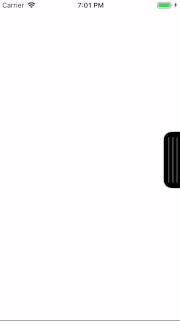

# WIZSideToolBar

- elemeth created as UIViewController category
- tap the tougleView for open rightMenu

HOW TO INSTALL

Import files from the folder "WIZSideToolBar Obj-C" to your project. 

HOW TO USE

1. Add category to the ViewController as #import

2. Add <WIZSideToolBarDelegate> to @intreface

3. Add ToolBox to screen

~~~~
self.delegate = self;
[self addWIZSideToolBar];
~~~~

4. Create buttons in the delegate method, for example

~~~~
-(NSArray <WIZToolBarButton*>*)WIZSideToolBarButtonImages
{
    WIZToolBarButton *firstBarButton = [[WIZToolBarButton alloc] initWithIcon:[UIImage imageNamed:@"fillCircle"] title:@"123"];
    
    WIZToolBarButton *emptyButton = [[WIZToolBarButton alloc] initWithIcon:[UIImage imageNamed:@"fillCircle"] title:@"000"];
    
    WIZToolBarButton *secondBarButton = [[WIZToolBarButton alloc] initWithIcon:[UIImage imageNamed:@"fillCircle"] title:@"234"];
    
    return @[firstBarButton, emptyButton, secondBarButton];
}
~~~~

5. Use the "-(void)WIZSideToolBarTapButton:(int)index" method to determine clicking

6. It's all. You can use this elementh.
